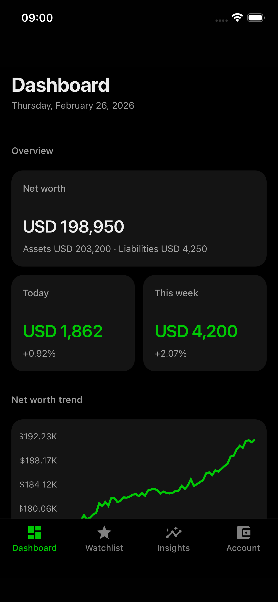
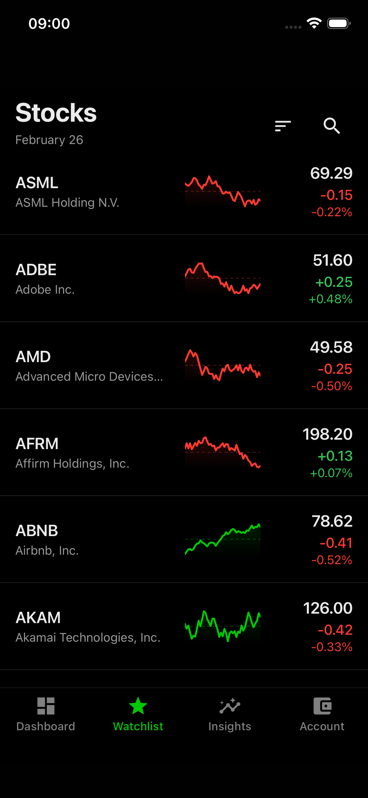
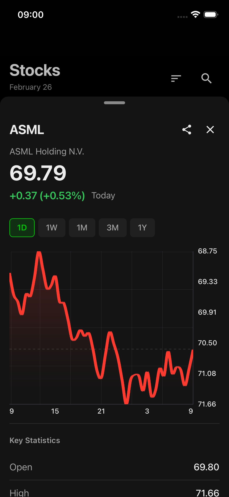
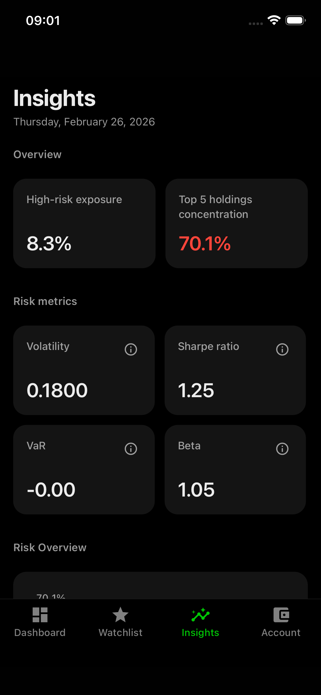
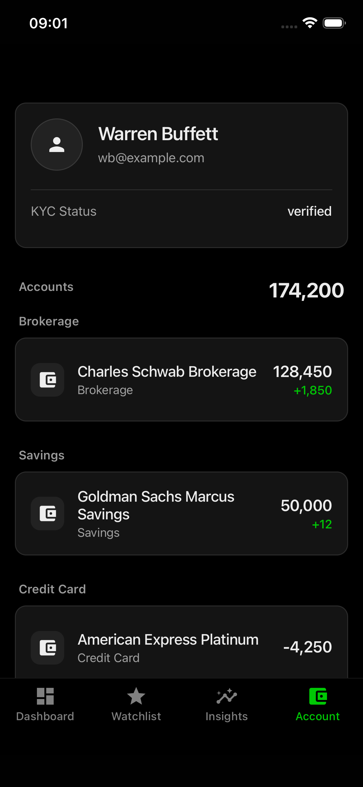
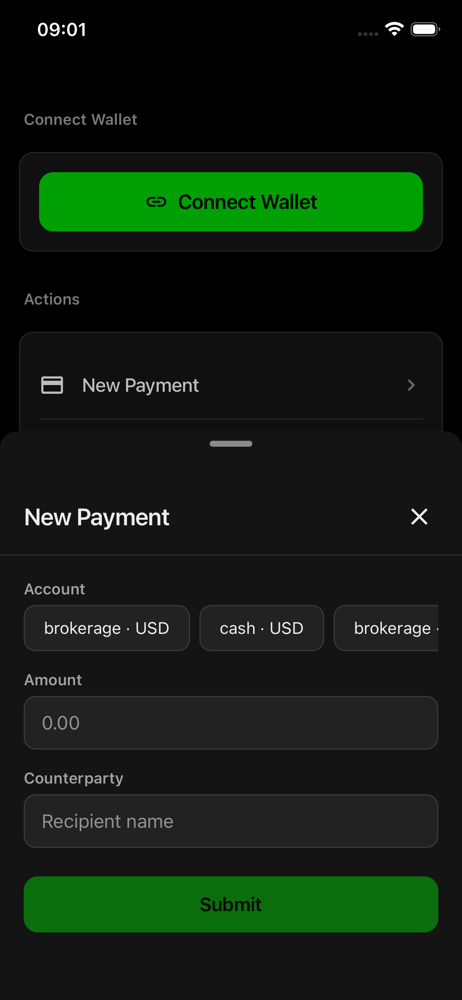
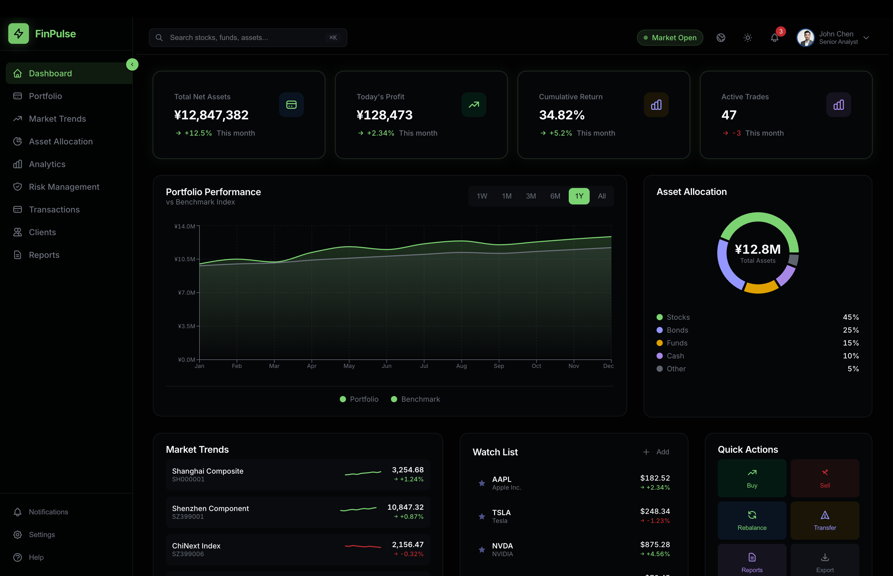
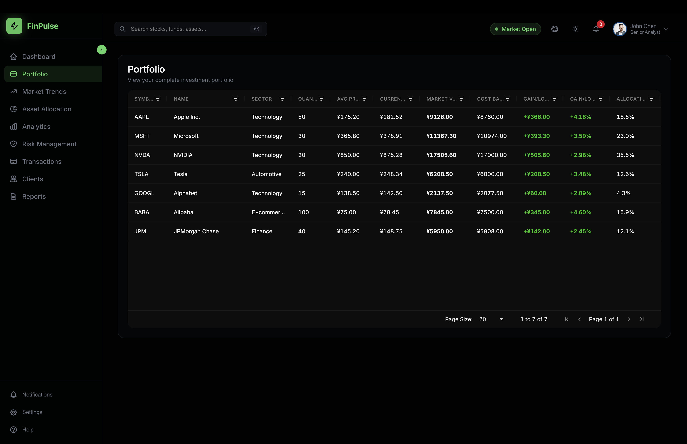
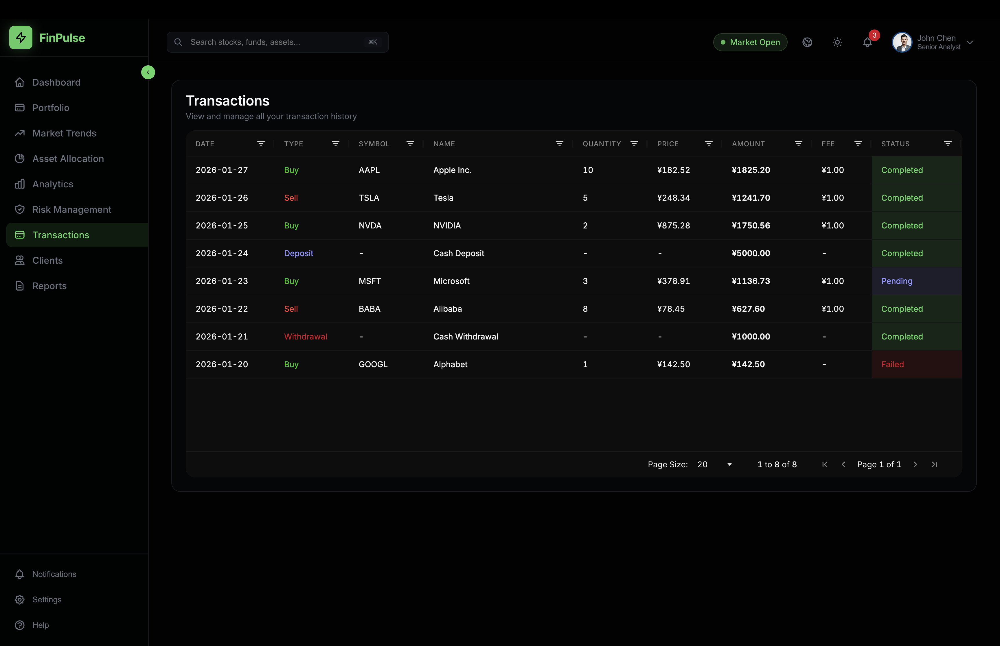
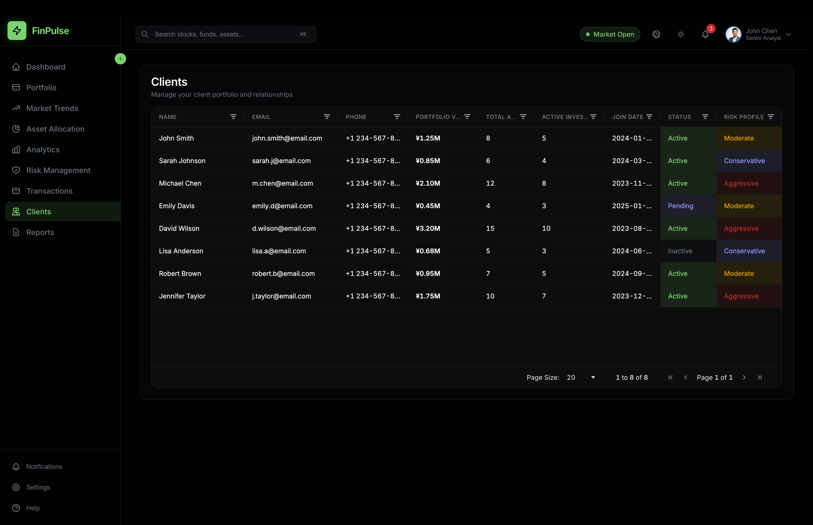

# FinPulse | Fintech Analytics Platform

Professional-grade financial data analysis and portfolio management platform.

Chinese docs: [docs/zh/README.md](docs/zh/README.md)

## Overview

FinPulse provides portfolio management, market analysis, and risk management. Built with React (admin, portal), React Native (mobile), and FastAPI/Go backends.

## Screenshots

### Mobile
<p align="center">
  
  
  
</p>
<p align="center">
  
  
  
</p>

### Admin
<p align="center">
  
  
  
  
</p>

## Tech Stack

- **Frontend**: React 19 + Vite, React Native + Expo, Emotion, Radix UI
- **Backend**: Python FastAPI (analytics), Go (gateway + CRUD: auth, blockchain, customers, accounts, watchlists), TimescaleDB, Redis, Kafka
- **Tools**: pnpm workspaces, TypeScript 5

## Quick Start

**Requirements**: Node 18+, pnpm 10.6+, Python 3.10+, Docker

```bash
pnpm install
pnpm dev              # Admin @ localhost:4200
pnpm dev:portal       # Portal @ localhost:3001
pnpm dev:finpulse-mobile   # Mobile (Expo)
pnpm run start:server # Backend (Docker + Python :8800 + Go :8801 + seed)
```

Use `http://127.0.0.1:8801` as API entry when backend is running.

## Project Structure

```
finpulse/
├── apps/
│   ├── admin/         # React admin console
│   ├── portal/        # React portal app
│   ├── mobile/        # React Native (Expo) app
│   ├── server-python/ # FastAPI backend
│   └── server-go/     # Go API gateway
├── packages/
│   ├── ui/            # @fintech/ui
│   └── utils/         # @fintech/utils
├── scripts/           # Backend start, seed, db
└── docs/              # Architecture, C4, ER diagrams
```

## Scripts

| Script | Description |
|--------|-------------|
| `pnpm dev` | Admin dev server |
| `pnpm dev:portal` | Portal dev server |
| `pnpm dev:finpulse-mobile` | Mobile Metro |
| `pnpm run start:server` | Backend (Docker + API + seed) |
| `pnpm build` | Build admin |
| `pnpm test:api` | Python API tests |
| `pnpm lint` | ESLint |

## Docs

- **Architecture**: `docs/en/rd/togaf/`, `docs/en/rd/c4/`
- **ER Diagram**: `docs/en/data/er-diagram/`
- **TODO**: `docs/en/TODO.md`

## Deploy (Vercel)

- Root: `/`
- Build: `pnpm install && pnpm --filter finpulse-admin build`
- Output: `apps/admin/dist`

## License

Private. Issues and PRs welcome.
